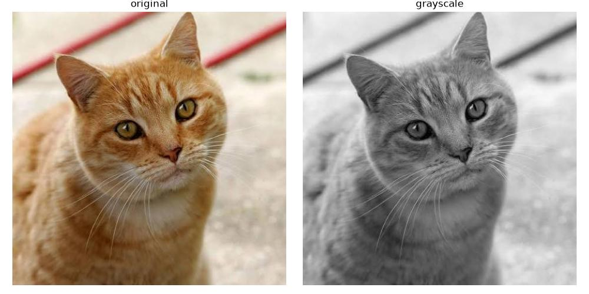
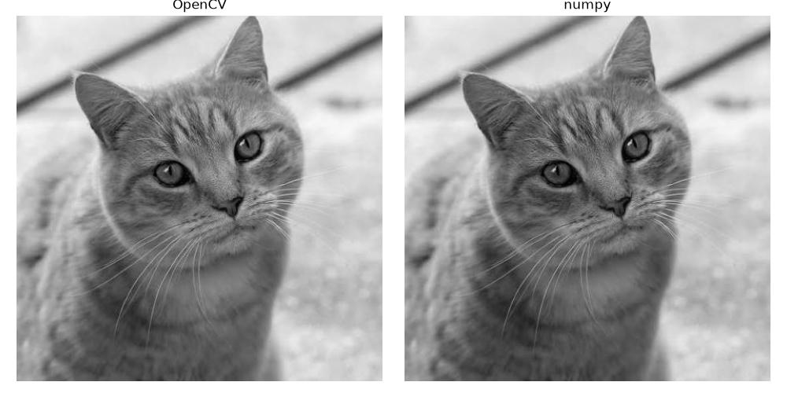
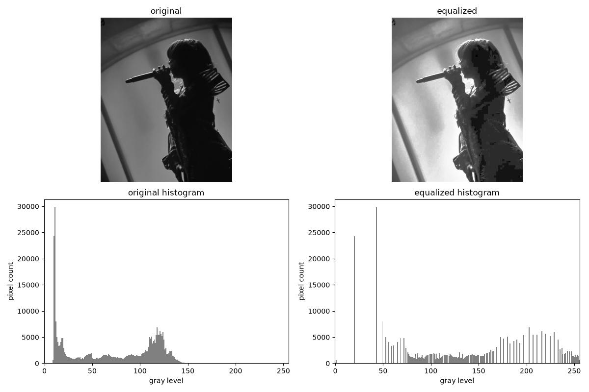
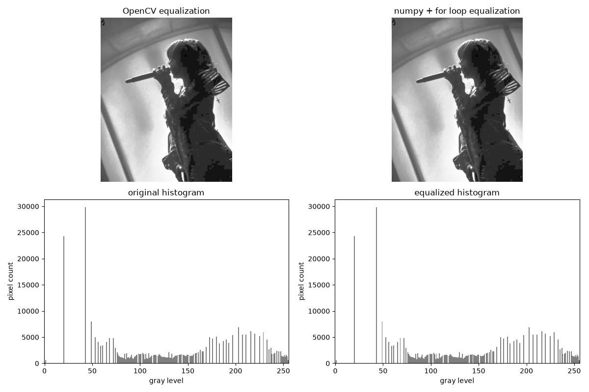
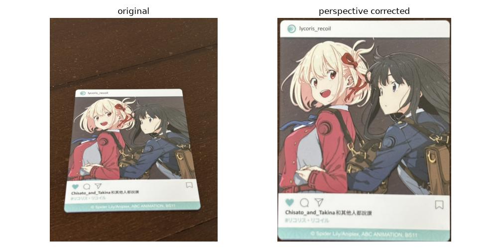
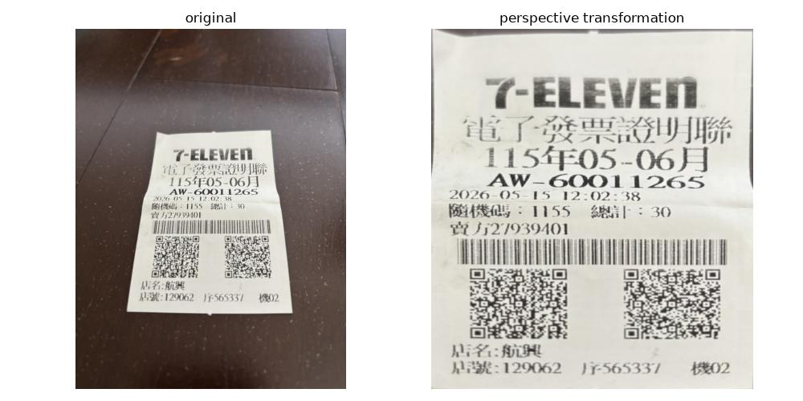

# quiz 1 基礎
用OpenCV讀入dataset資料夾中的圖，直接將讀入的BGR圖片轉成灰階，再用Matplotlib顯示結果，並存入result資料夾
### 比較圖

# quiz 1 進階
## 用numpy與雙層for loop實作灰階轉換，在quiz1.py中建立def grayscale_mean(image)函式
先將image的height與width讀取，建立全零的二維矩陣gray_image，大小為(height, width)，再將image每piexl中的RGB值取出，先轉為整數避免相加時溢位，計算三者的算術平均數，將結果填入gray_image的對應位置
### 比較圖

## 差異比較
執行速度：OpenCV的轉換速度明顯高於numpy自行實作，因為OpenCV利用底層編譯好的C++程式進行影像轉換，而自行實作使用for loop處理每pixel，每次都需進行陣列存取、型別轉換與數值運算。本實驗結果不能認為加權平均比算術平均快

轉換結果：OpenCV使用的是加權平均轉換成灰階圖，自行實作是使用算術平均，因此部分灰階亮度不同

# quiz 2 基礎
用OpenCV對灰階圖做histogram equalization，並分別統計處理前後各灰階值的影像數量，再用Matplotlib顯示結果，並存入result資料夾
### 比較圖

# quiz 2 進階
## 用numpy實作histogram equalization，在quiz2.py中建立def equalized_numpy(image)函式
建立長度為256的histogram陣列，統計每個灰階值出現次數，利用均衡化公式將範圍投影至0~255，建立新舊灰階值的對照表
### 比較圖

## 差異比較
執行速度：OpenCV的轉換速度明顯高於numpy自行實作，因為OpenCV透過底層編譯並最佳化的程式執行，而自行實作的方法使用for loop逐像素統計與查表。本實驗結果主要反映實作方式的差異，不能認為numpy的所有用法都較慢

轉換結果：兩種方法使用相同原理的直方圖均衡化，預期會得到相近的亮度分布與對比效果

# quiz 3 基礎
## 在main.ipynb輸入圖片名稱，在quiz3.py中建立select_corners(image)、correct_perspective(image)函式
使用斜拍小卡(7:9)作為輸入，用OpenCV讀取圖片

利用select_corners，先將圖片等比例縮小後顯示在點選視窗上，手動點選左上、右上、右下、左下角，確認後將預覽圖點選座標轉換回原圖座標

最後用correct_perspective將四個角對應輸出至長方形的四個角，利用cv2.getPerspectiveTransform()計算透視轉換矩陣，再透過cv2.warpPerspective()對原圖進行校正，結果存入result資料夾
### 比較圖

# quiz 3 進階
## 在main.ipynb輸入圖片名稱，在quiz3.py中建立find_corners(image)、order_points(approx)、warp_image(image, ordered_points)函式
使用find_corners將圖轉為灰階，使用9*9的高斯模糊減少雜訊，再透過Otsu自動選擇門檻進行二值化，將較亮的紙張與較暗的背景分開 
(原先使用Canny偵測邊緣，但部分圖片的紙張外圍未形成完整包圍，反而選到文字或QR Code) 
接著找出最外圍輪廓，選擇面積最大的輪廓，並以輪廓周長的2%作為容許誤差，使用cv2.approxPolyDP()將其近似成多邊形，確認結果為四個頂點且形成凸四邊形後，才繼續處理

利用order_points找出四個頂點的中心位置，計算各點與中心相對位置，使用np.arctan2()計算方向角度，再使用np.argsort()依角度排列，形成順時針順序，再選擇x+y最小的做為起點，使用np.roll()循環調整排列 
(原本使用x+y與x-y的最大最小值判斷四角，但旋轉物體會造成重複點選)

最後用warp_image計算四邊長，取上下兩邊較長者作為輸出寬度，左右兩邊較長者作為輸出高度，建立輸出的四角座標，再用cv2.getPerspectiveTransform()計算轉換矩陣，以及cv2.warpPerspective()產生校正圖，結果存入result資料夾
### 比較圖

## limitation與原因
長寬比失真：因為斜拍會造成長寬比失真，直接使用其大小會造成圖片些許變化，且無法完全校正彎曲與摺痕

閱讀方向不正確：角點排序根據各點相對中心的角度，能避免重複選點，但沒有利用文字內容判斷物體的正上方，若物體向右轉向太多，x+y最小值有可能出現在物體左下角，因此圖片可能被校正成橫向

依賴物體與背景亮度差異：Otsu二值化適合白色紙張搭配深色背景，若背景與紙張亮度接近就可能無法將紙張完整分離