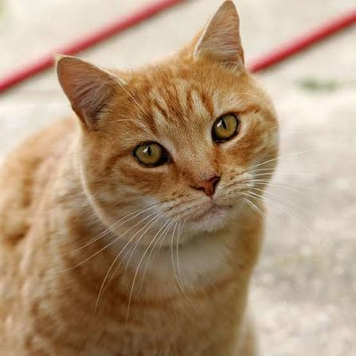
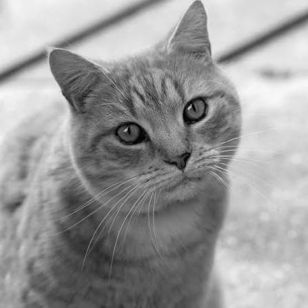
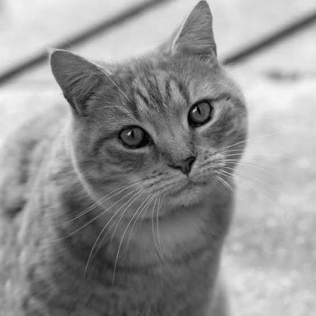

# quiz 1 基礎
用OpenCV讀入dataset資料夾中的圖，直接將讀入的BGR圖片轉成灰階，再用Matplotlib顯示結果，並將灰階圖片存入result資料夾
### 轉換前

### 轉換後

# quiz 1 進階
## 用numpy與雙層for loop實作灰階轉換，建立def grayscale_mean(image)函式
先將image的height與width讀取，建立全零的二維矩陣gray_image，大小為(height, width)，再將image每piexl中的RGB值取出，先轉為整數避免相加時溢位，計算三者的算術平均數，將結果填入gray_image的對應位置
### 轉換前

### 轉換後

## 差異比較
執行速度：OpenCV直接用套件的轉換速度明顯高於numpy與for loop，因為OpenCV利用底層編譯好的C++程式進行影像轉換，而自行實作使用for loop處理每pixel，每次都需進行陣列存取、型別轉換與數值運算。本次實驗結果不能認為加權平均比算術平均快
轉換結果：OpenCV使用的是加權平均轉換成灰階圖，自行實作是使用算術平均，因此部分灰階亮度不同

### OpenCV轉換

### numpy + for loop轉換
