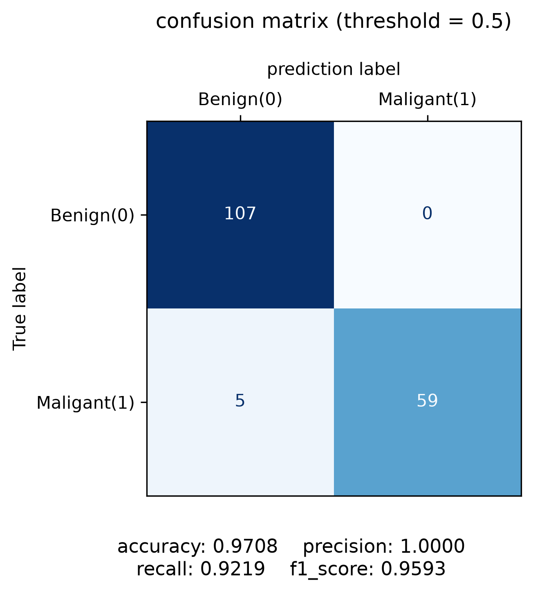
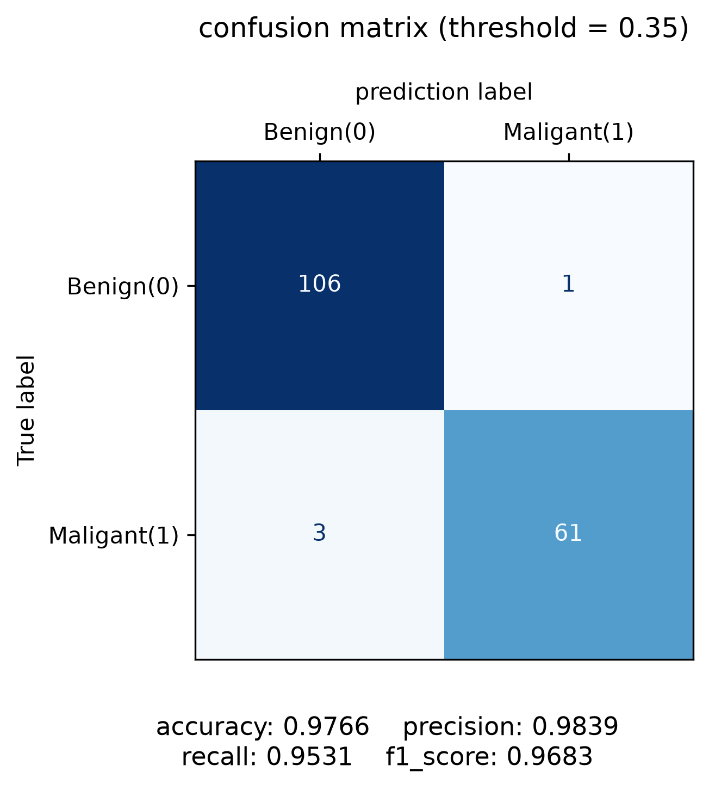
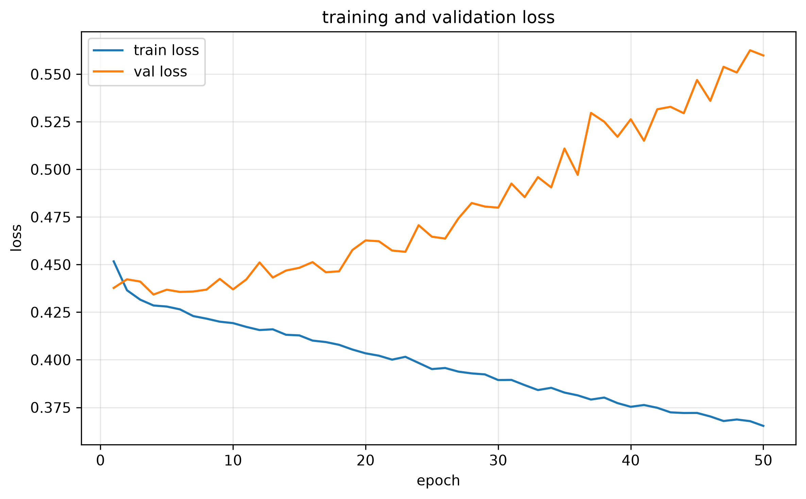
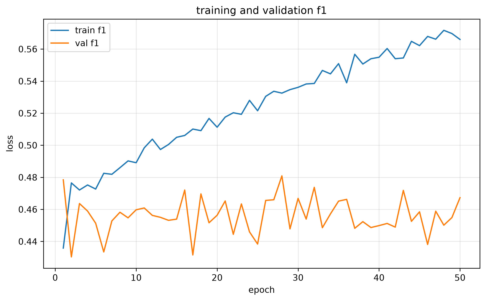
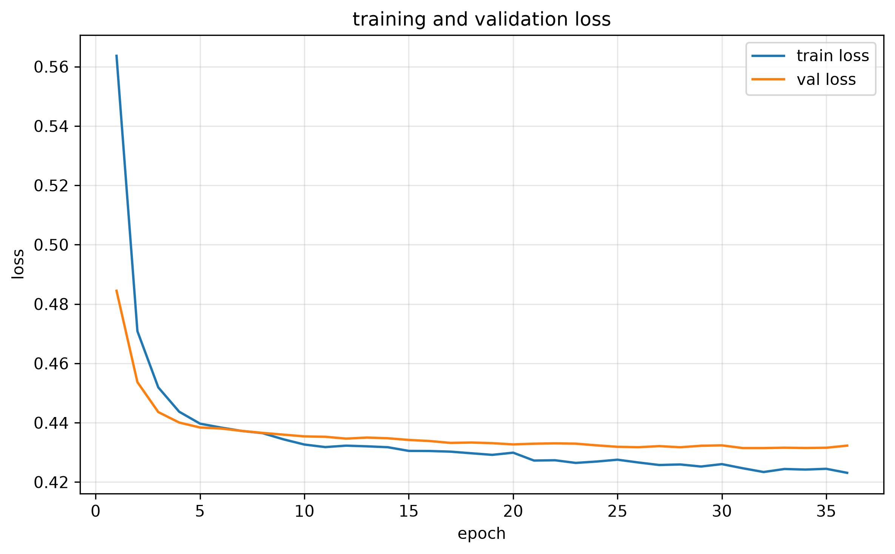
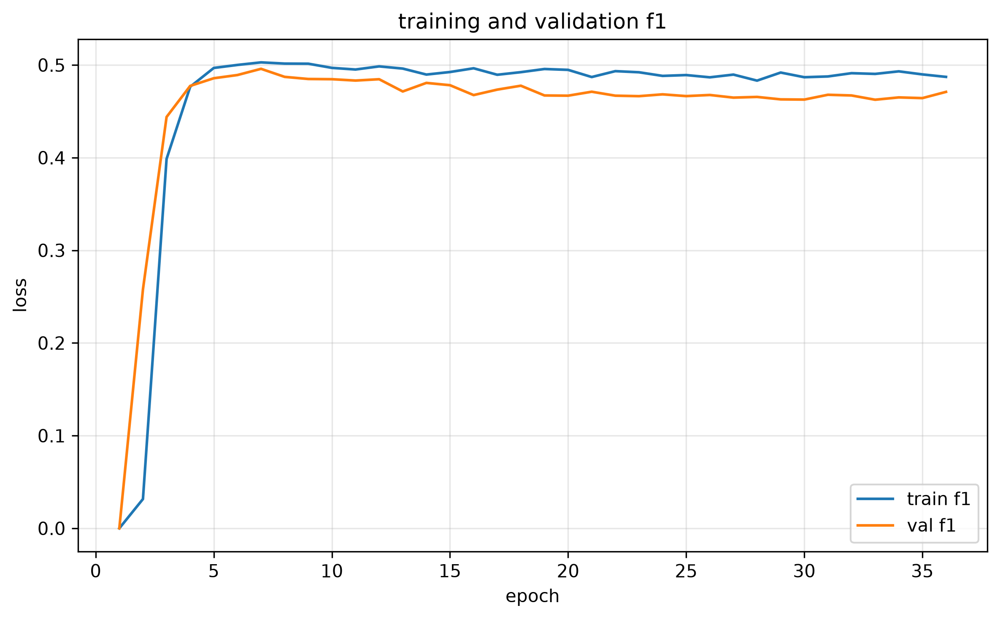
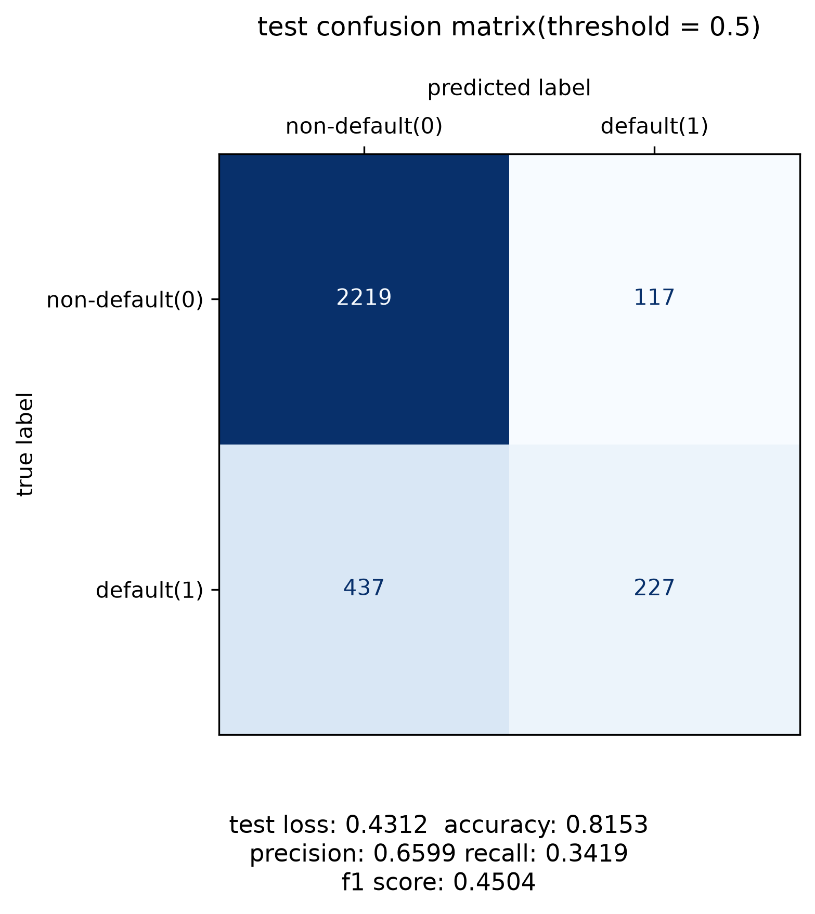

# quiz 1 基礎
使用Breast Cancer Wisconsin(Diagnostic)資料集，根據腫瘤測量特徵預測良性或惡性，將diagnosis做為目標y，M(惡性)=1、B(良性)=0。 

使用Logistic Regression實作分類任務。資料共569筆，使用30個數據特徵作為輸入，利用data_segment()做資料切分，training/validation以70%/30%切分，使用stratify=y維持類別比例，random_state=42固定切分結果；在feature_scale()中利用StandardScaler進行特徵標準化；進行模型訓練與驗證後將confusion matrix與輸出指標(accuracy、precision、recall、f1-score)儲存至result資料夾。 

調整threshold時，沿用同一個訓練完成的模型，不重新訓練。

### 比較圖  (左：threshold=0.5 | 右：threshold=0.25)

  
  

# quiz 1 進階
## 將模型改為Random Forest
設定n_estimators=100、random_state=42，沿用相同的training、validation切分及縮放後的特徵，比較不同threshold跟模型的表現差異。

### 比較圖  (左：threshold=0.5 | 右：threshold=0.35)

  
  

## 差異比較
### threshold挑選依據：從0.5出發，以0.1為步距比較f1，改善停止後，額外測試相鄰門檻的中點，最後選擇所有已測試門檻中validation f1最高者
threshold=0.5時，Logistic Regression在recall與f1 score表現較好，accuracy表現與Random Forest相同，而precision表現較差；Logistic Regression有4筆FN、1筆FP，Random Forest有5筆FN、0筆FP，若重視減少漏判惡性，Logistic Regression較好；若重視減少誤報，Random Forest較好。 

Logistic Regression表現最好為threshold=0.25時。 

Random Forest表現最好為threshold=0.35時。

# quiz 2 基礎
使用pandas讀取資料，檢查欄位名稱、資料型態、缺失值及各類別分布，依照欄位意義決定前處理方式。 
(default.payment.next.month作為預測目標，SEX使用二元編碼，EDUCATION、MARRIAGE與六個還款狀態欄位使用one-hot encoding，其他使用StandardScaler標準化) 

使用data_segment()將資料切分成train：70%、validation：20%、test：10%，使用stratify維持目標類別比例，並設定random_state=42。 

使用feature_preprocess()完成編碼與標準化。 

利用create_dataloader()輸出的DataLoader分批取出資料，輸入MLP模型，結構為： 
90 -> 64 -> 32 -> 1 
模型包含兩個隱藏層，分別有64、32個神經元，並使用ReLU，加上輸出層，共三個linear層。訓練時搭配BCEWithLogitsLoss，計算分類指標時，使用Sigmoid轉成違約機率，再以threshold＝0.5判斷類別。 

使用train_model()訓練模型，設定為： 
optimizer：Adam 
learning rate：0.001 
epochs:50 

使用evaluate_model()評估第50個epoch結束時的模型，記錄輸出指標，再以save_result_plots()產生loss、f1 score、test confusion matrix與五項指標，共三張圖，存入result資料夾。

### 結果圖

  
  

  

# quiz 2 進階
## 調整learning rate、模型結構、hidden layer，加入early stopping、dropout、正則化
沿用基礎題的資料切分與前處理，調整包含以下： 
learning rate改為0.0001。 
模型結構：90 -> 128 -> 64 -> 32 -> 1 共四層linear層。 
加入early stopping，監控validation loss，並還原最佳epoch的模型權重。 
加入dropout，設定為0.2。 
加入正則化，weight_decay設定為0.0001。 
模型皆使用threshold=0.5，在相同test dataset上做比較。 

version 2在test dataset上的結果皆比version 1進步，從混淆矩陣觀察，FP減少31筆，FN則減少6筆，並減輕overfitting的程度，但不代表分類問題已完全解決。

### 比較圖  (左：version 1 | 右：version 2)

  
  

  
  

  
  

# quiz 3 基礎

