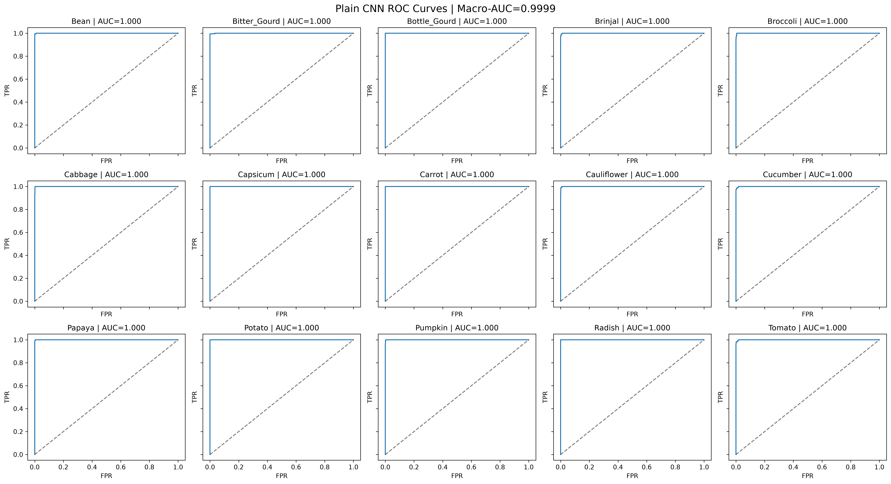
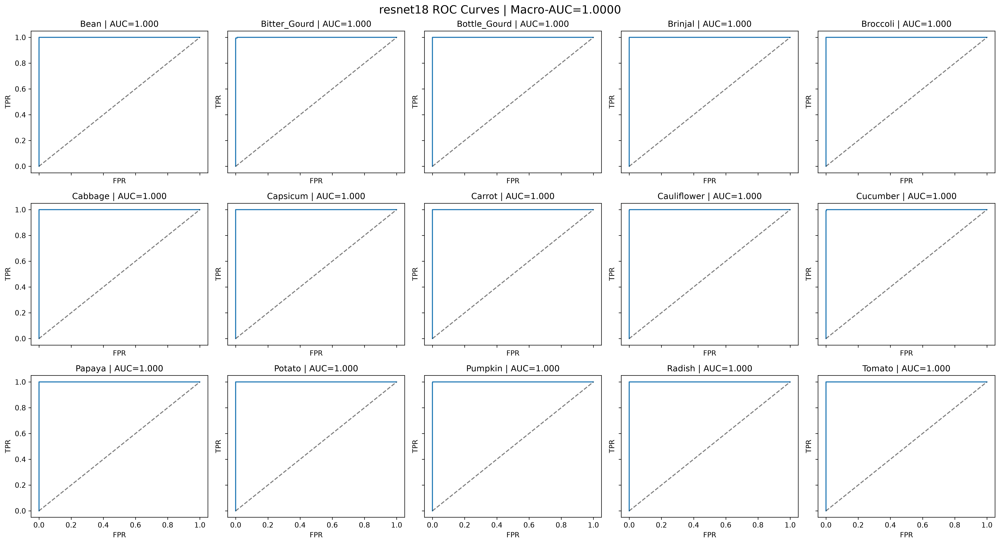

# QUIZ 1
使用Kaggle的Vegetable Image Dataset，共有15類，21000張224*224的影像，雖然已經分好train(15000)、validation(3000)、test(3000)資料夾，為了使用k-fold交叉驗證(k=5)，將validation的資料搬回train資料夾。 

利用quiz1.py中的def scan_images()將圖片路徑與categories編號配對，再利用5-fold validation將資料切成5等分。 

模型輸入為一張蔬菜影像，輸出為該影像屬於各類別的預測分數，並以分數最高的類別作為最終預測，每張影像對應一個類別標籤，因此這是單標籤、多類別分類任務。 

資料集共有15個類別，分類目標是讓模型學習各類蔬菜的影像特徵，對未見過的影像正確辨識其類別，後續將以Top-1 Accuracy和Top-5 Accuracy評估分類表現。

# QUIZ 2 基礎
## 設計PlainCNN模型，利用4層CNN，接上flatten與linear預測結果類別
將quiz 1完成的train_records、test_records、folds傳入train_five_folds()，呼叫run_epoch()進行訓練。將每fold最低val loss作為該fold最佳結果，儲存模型權重，5 fold結束後印出每fold的最佳結果。

接著使用ResNet-18進行遷移學習，載入ImageNet預訓練權重並凍結特徵擷取部分，將最後的全連接層(Fully Connected Layer)替換為15類輸出，只訓練新的分類層，沿用相同的5-fold資料切分，評估模型的分類表現。

### 結果圖
## PlainCNN

## ResNet-18

在test data表現上，兩個模型的AUC和ROC在每個類別都有優異的表現，而在validation loss與F1-score上，ResNet-18表現較好，同時ResNet-18的參數量也比PlainCNN大26倍左右，訓練時長多了4.8倍(454/93)。

# QUIZ 2 進階
