# quiz 1
## Sentiment Analysis使用IMDB Dataset of 50K Movie Reviews資料集
確認CSV欄位為review、sentiment，共50,000筆，正負面各25,000筆。 
檢查缺失值與空白影評，皆為0；找到418筆額外重複影評，且相同影評沒有label衝突。

## Image Classification使用Rock-Paper-Scissors Images資料集
統計各類圖片數量，逐張讀取，確認沒有讀取失敗，圖片皆為RGB、300 * 200。 
每類抽樣一張確認內容符合label，並透過圖片內容的SHA-256 hash檢查，未找到完全相同的圖片。

## Image Captioning使用Flickr 8k Dataset資料集
確認有8,091張圖片、40,455筆captions，每張對應5筆，缺失值、空白檔名與空白caption皆為 0，圖片檔名與caption表格皆能互相對應。 
圖片全部可讀取、皆為RGB，圖片尺寸多不相同。抽樣確認圖片符合captions，找到10筆額外重複image-caption配對，以及1張額外重複圖片。

# quiz 2 基礎
將IMDB Dataset of 50K Movie Reviews資料以80%、10%、10%分成train、validation、test。 
利用`tokenize()`移除HTML tags、轉小寫，取出英文單字。 
利用`build_vocab()`統計train dataset詞頻，收錄最多的20,000個tokens。 
利用`text_to_ids()`將tokens查表轉換成IDs，未收錄的詞用`<UNK>`。 
利用`collate_reviews()`將sequence補PAD至該batch最長sequence。 

模型架構方面，輸入為128維embedding，連接至單層單向RNN(hidden size=128)，最後用linear分類層輸出兩類logits。 

使用batch size=32、Cross-Entropy Loss、Adam、learning rate=0.001、dropout=0.3、gradient clipping=1.0、early stopping，以及pack_padded_sequence()，讓RNN跳過補位位置。

### 結果圖
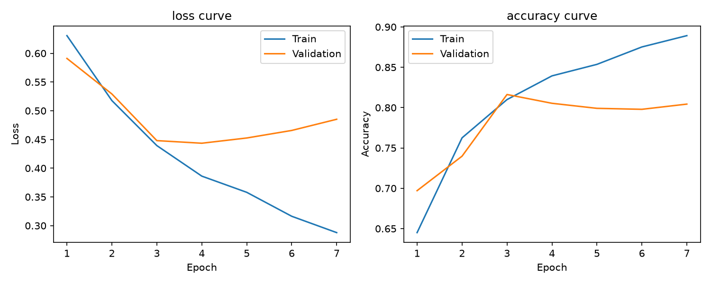
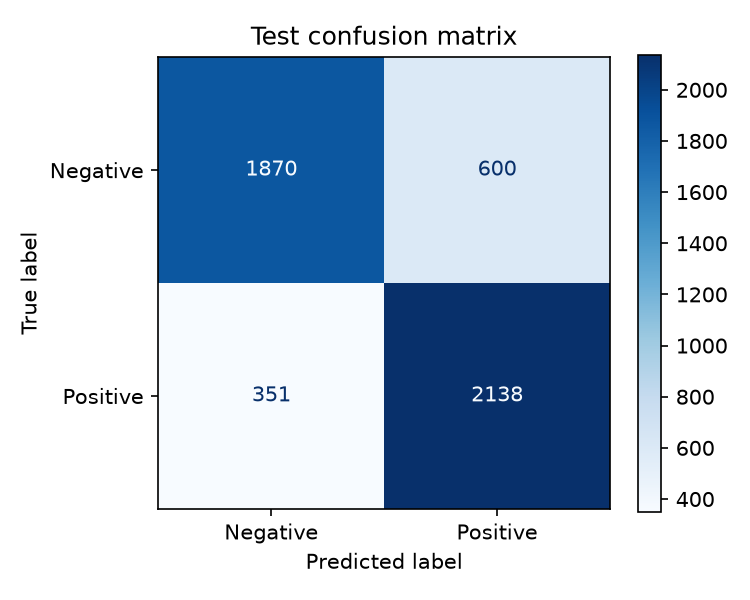

# quiz 2 進階
## 沿用quiz 2基礎的流程，更換為LSTM模型
模型架構一樣為輸入128維embedding，連接單層單向LSTM(hidden size=128)，最後用linear分類層輸出兩類logits。 
loss function、optimizer等等都與RNN相同。

### 結果圖
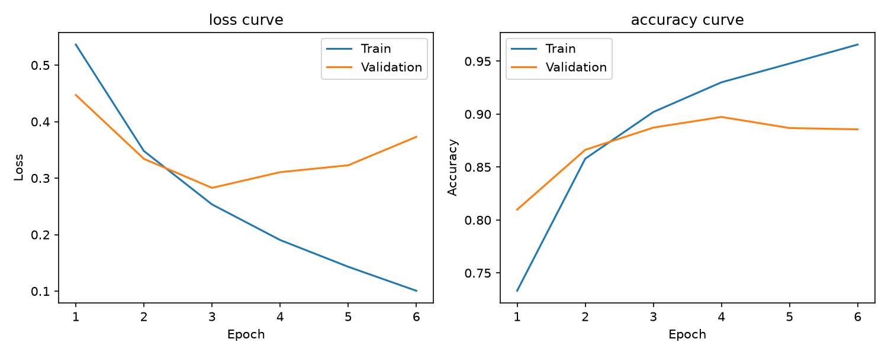
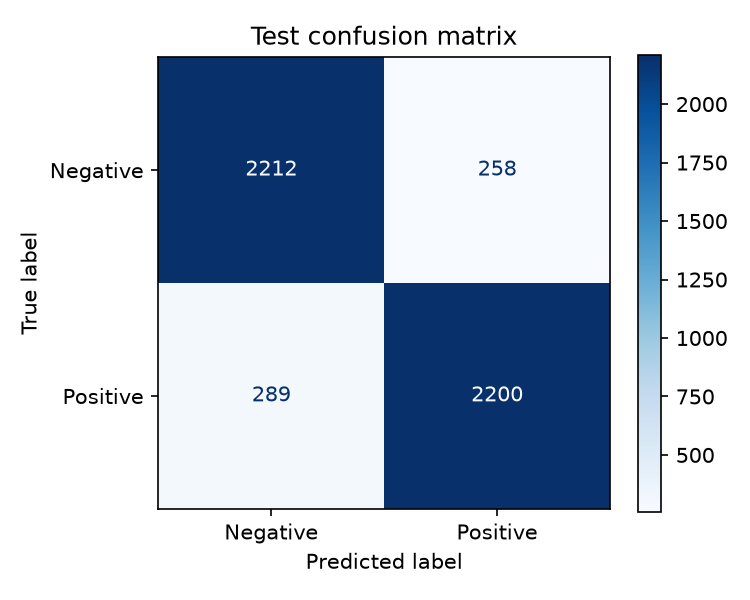

## 結論
由結果可以看出，在相同架構下，LSTM的test loss、accuracy、macro f1-score都比RNN表現要好，從混淆矩陣上也可以看出LSTM表現較好，但兩個模型都有嚴重的overfitting。

# quiz 3 基礎
利用`prepare_splits()`將Rock-Paper-Scissors Images資料以80%、10%、10%分成train、validation、test，並設定rock=0、paper=1、scissors=2。 
使用`create_vit()`載入timm，取得ViT的輸入設定，將圖片轉成RGB、調整尺寸、轉成tensor並normalize，並加入隨機裁切、水平翻轉和色彩變化。 

模型架構方面，使用pretrained ViT-Tiny，將輸出改為三類，凍結backbone只訓練最後的分類層。 

使用batch size=32、Cross-Entropy Loss、AdamW、learning rate=0.001、weight decay=0.01、early stopping。

### 結果圖
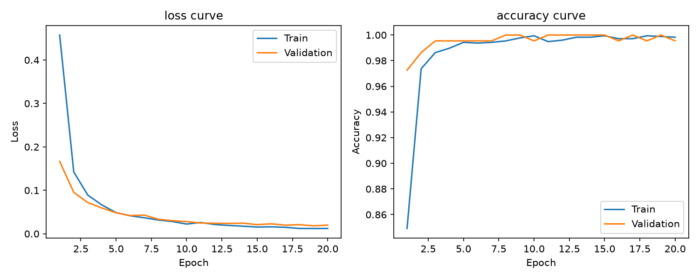
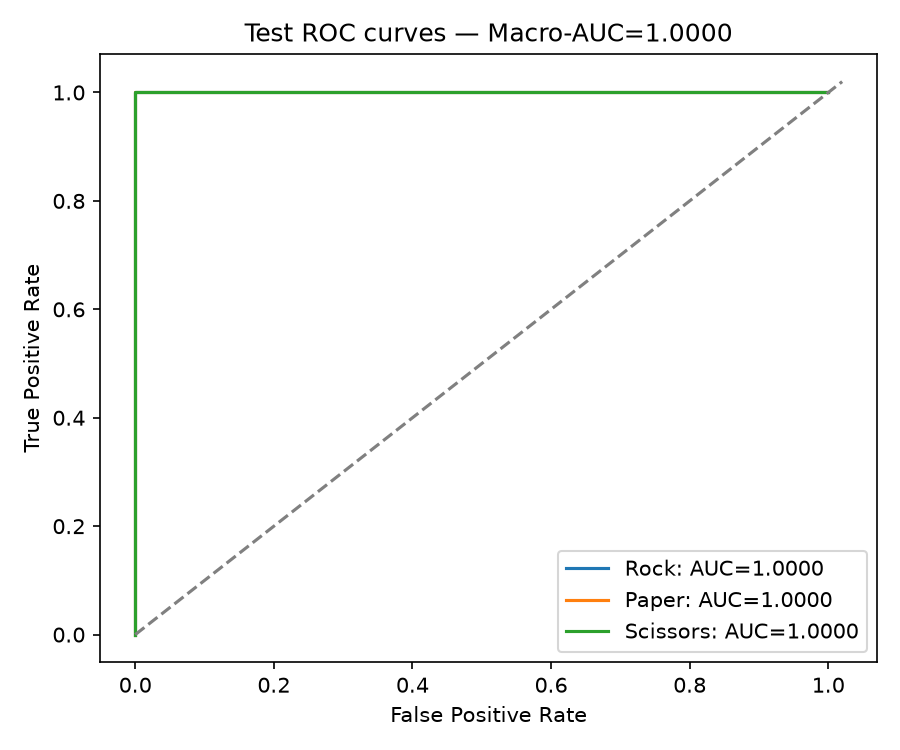

# quiz 3 進階
## 沿用quiz 3基礎的流程，更換為ResNet-18模型
模型架構一樣為凍結backbone，將輸出改為三類，只訓練最後的分類層。 
loss function、optimizer等等都與ViT相同。

### 結果圖
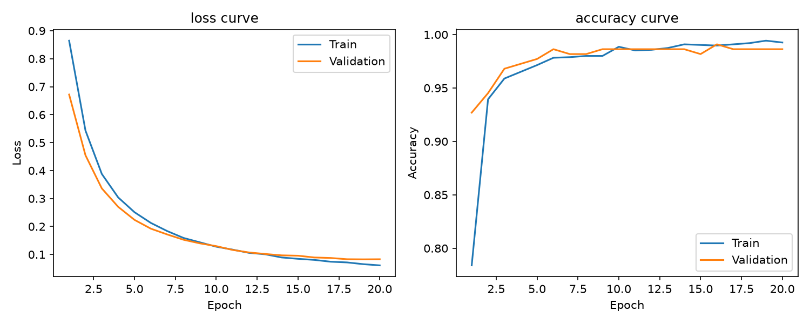
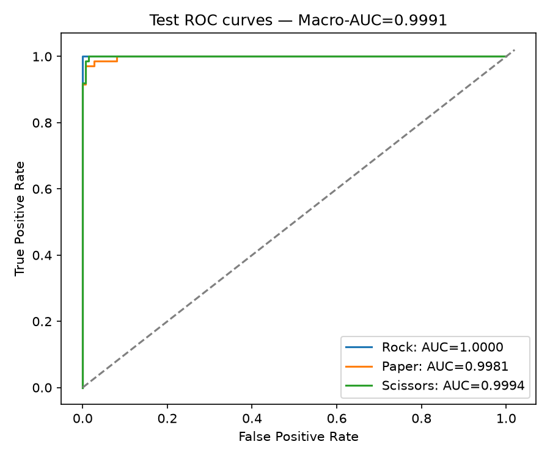

## 結論
由loss和accuracy curve可以看出ViT在訓練時比較穩定，並且test loss與macro f1-score也比ResNet-18好上不少，雖然ResNet-18表現看似比ViT差上不少，但兩者在macro AUC皆表現優異。

# quiz 4 基礎
## 模型使用ImageNet pretrained ViT-Tiny作為encoder，LSTM作為decoder
使用`prepare_splitsprepare_splits()`將Flickr 8k Dataset資料，以圖片為單位用80%、10%、10%分成train、validation、test，同一張圖片的所有captions放在同一份資料集。 
利用`tokenize()`將文字轉成小寫，`build_vocab()`建立vocabulary，最多包含10,000個tokens，加入4種特殊token：`<PAD>`、`<UNK>`、`<BOS>`、`<EOS>`，再用`text_to_ids()`將captions轉成token IDs，並在每個batch中補齊至最長句子的長度。 
利用`create_transform()`將圖片轉成RGB，縮放至224 * 224，轉成tensor，並使用ImageNet mean、std進行normalization。 

模型架構部分，使用ImageNet預訓練的ViT-Tiny作為圖片encoder，移除分類層，取得每張圖片的192維feature，並凍結參數，不更新backbone。 

decoder部分為單層LSTM架構，文字Embedding維度與hidden size均為256。 
圖片feature經由兩個Linear層，分別轉成LSTM的初始hidden state和cell state，caption的token IDs則經過Embedding，作為LSTM每個時間步的輸入。 
在文字Embedding後與LSTM輸出後加入dropout，並使用Linear輸出層，預測下一個token在vocabulary中的分數。 

使用batch size=32、Cross-Entropy Loss、AdamW、learning rate=0.001、weight decay=0.01、dropout=0.3、gradient clipping=1.0、early stopping。 

### 結果圖
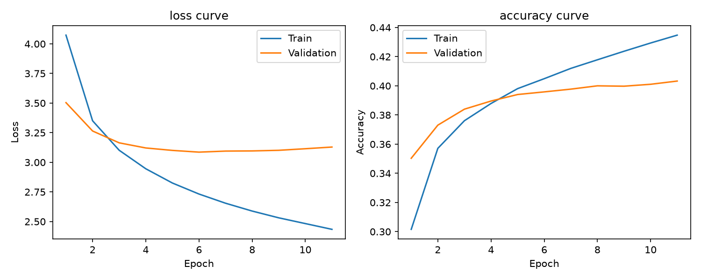

載入最佳checkpoint，以test圖片觀察生成結果，使用greedy decoding，每一步選取分數最高的token作為下一步輸入。

### Gemini判斷結果  (左圖：prompt | 右圖：response)
API測試遇到服務暫時不可用的錯誤，後續改用Gemini網頁版 
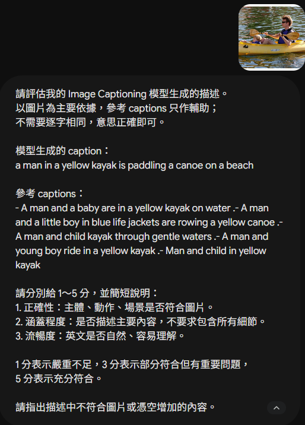
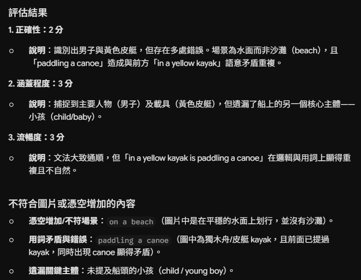

# quiz 4 進階
使用BLEU評估，載入最佳模型，對test dataset中每張圖片使用greedy decoding生成一句caption，將生成描述與參考描述拆成tokens，使用NLTK的`corpus_bleu()`計算整個test dataset的BLEU-1～BLEU-4。

## 實驗結果
本次實驗使用gemini網頁版，BLEU在本機上測試，且兩種評估方式的樣本數與計時範圍不同，因此未進行公平的回覆時間比較。 

模型在test dataset上的BLEU-1～BLEU-4分別為0.5266、0.3475、0.2222、0.1428，顯示生成描述與參考captions存在一定程度的文字重疊，但較長詞組的匹配仍有限。 
單張圖片的Gemini評估中，正確性為2/5、涵蓋程度與流暢度皆為3/5，其評語指出模型能辨識部分主要內容，但仍有場景誤判、主體遺漏及用詞不自然的問題。 
BLEU提供整體文字匹配指標，Gemini則補充個別案例的具體問題。