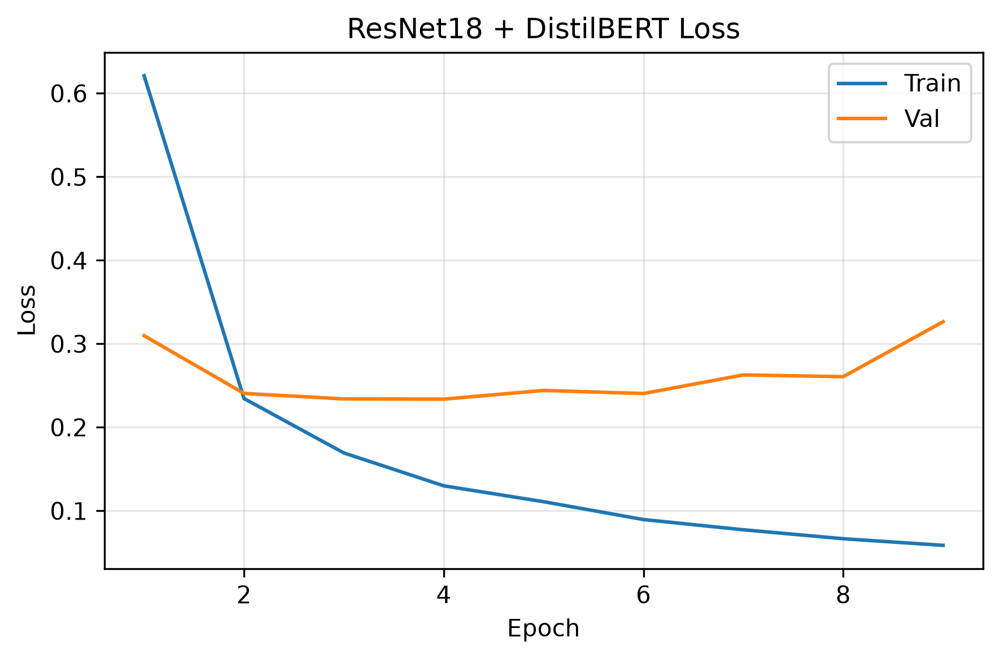
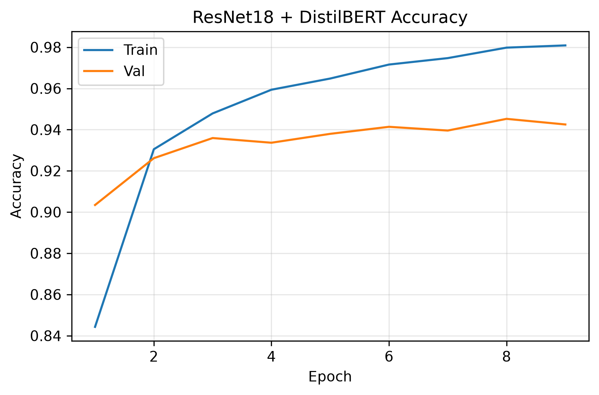
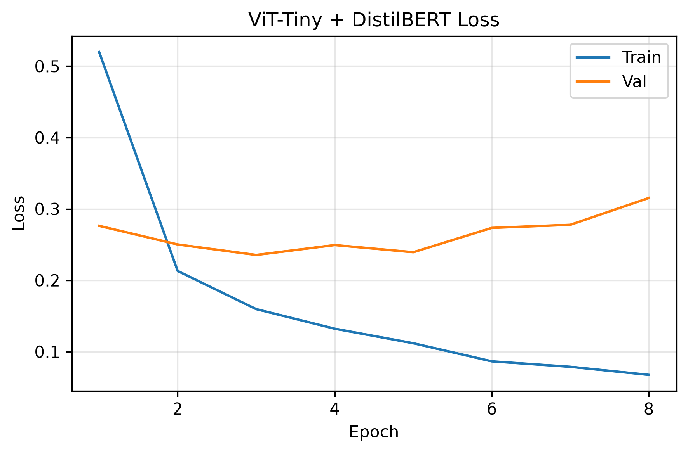
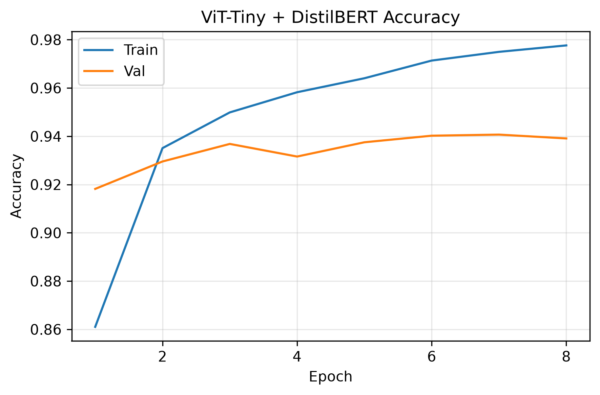
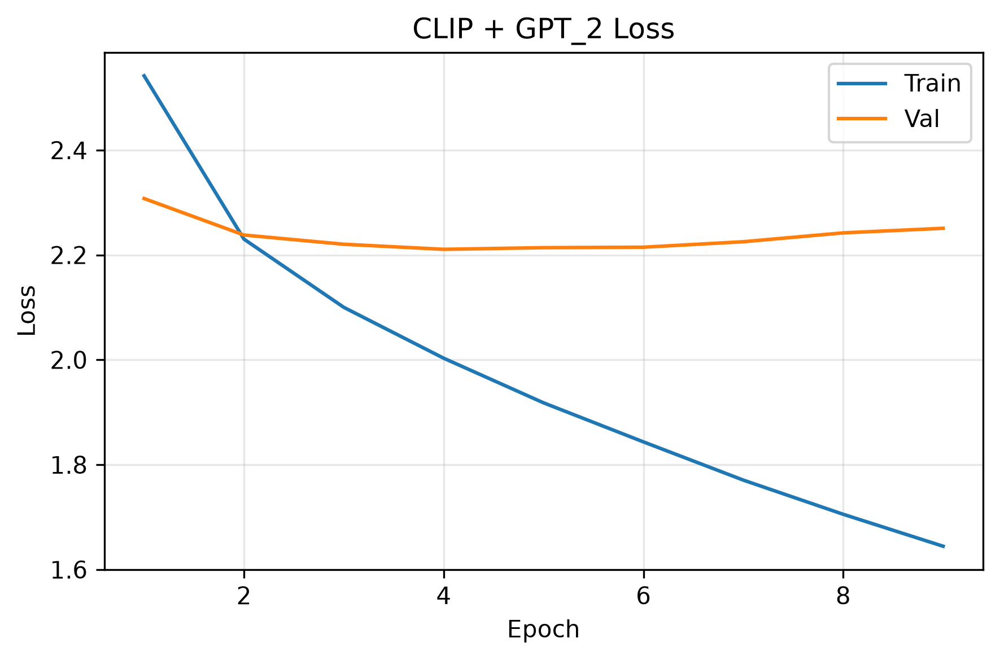
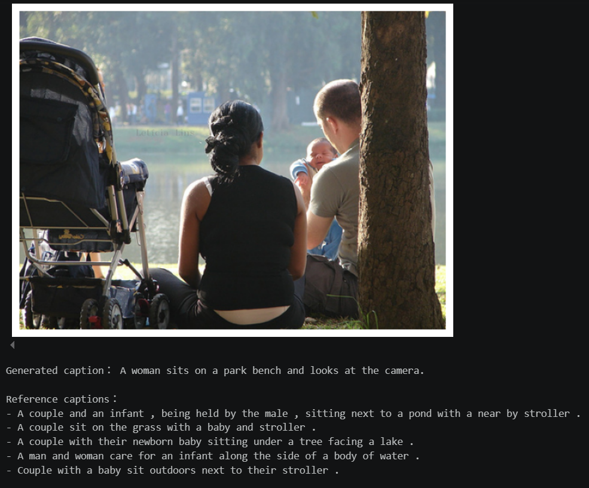

# quiz 1 基礎
## 載入預訓練ResNet-50，將分類層改成六類並微調模型
資料集使用`Intel Image Classification`，包含六種場景類別，掃描圖片路徑、標籤、尺寸、色彩模式，並檢查圖片是否能正常讀取。 
將`seg_train`資料按比例切成`80% train`、`20% validation`，`seg_test`做為模型完成的測試資料，`seg_pred`作為檢索推論的query。 
訓練圖片前處理使用`build_resnet_transforms()>`做隨機裁切、翻轉與顏色變化。 

利用`build_resnet50()`載入預訓練模型，將分類層改成六類並微調模型。 
模型使用`Cross-Entropy Loss`、`Adam`、`batch size=64`、`learning rate=0.0001`、`weight decay=0.0001`、`early stopping`，記錄最低`val loss`最後最佳模型。 

使用`build_feature_model()`複製最佳模型並移除分類層，使模型直接輸出影像特徵向量。 
以訓練圖片作為`gallery`，使用`extract_features()`固定前處理萃取並正規化特徵。 
從`seg pred`選取`query`，利用`show_retrieval()`計算與`gallery`的`cosine similarity`，找出`Top-5`相似圖片，並展示結果。

### 結果圖

# quiz 1 進階
## 載入預訓練ViT-Small，將分類層改成六類並微調模型
沿用`quiz 1 基礎`整體流程，使用`build_vit_transforms()`做資料前處理；利用`build_vit_small()`載入預訓練模型。 

### 結果圖

## 結果討論
在`test loss`部分，`resnet50`表現較好，而`test accuracy`部分則是`vit-small`表現較好，數值差異皆不大。 
影像檢索部分，`vit-small`給出的`similarities`分數較高，兩者找回的場景雖然都不同，但都符合`query`的圖片，個人認為`resnet50`找回的場景較精準。 
訓練過程中兩個模型皆出現過擬合現象，因此加入資料增強與`early stopping`，並使用最低`val loss`的模型權重進行測試與檢索。

# quiz 2 基礎
## 利用預訓練的ResNet-18作為image encoder、DistilBERT作為text encoder
資料集使用`Mini Fashion Product Images and Text Dataset`，首先進行資料檢查與清理，檢查缺失值、圖片可用性及圖文配對，保留至少有10筆資料的類別，再進行資料切分按比例切成`80% train`、`10% validation`、`10% test`。 

圖片利用`build_transforms()`進行前處理，訓練資料加入隨機水平翻轉。 
利用`DistilBERT tokenizer`將商品描述轉成`token IDs`和`attention mask`。 
利用`MultimodalClassifier()`對文字特徵進行`masked mean pooling`，再與圖片特徵串接，送入分類層預測商品類別。 

模型使用`Cross-Entropy Loss`、`AdamW`、`batch size=64`、`weight decay=0.0001`、`early stopping`，記錄最低`val loss`最後最佳模型，共同微調圖片模型、文字模型和分類層，`learning rate`依照`image encoder`、`text encoder`、`classifier`給予不同大小。

### 結果圖

# quiz 2 進階
## 利用預訓練的ViT_Tiny作為image encoder、DistilBERT作為text encoder
沿用`quiz 1 基礎`整體流程，在`build_transforms()`的`mean`與`std`使用預訓練模型的資料設定。

### 結果圖

## 結果討論
兩者在訓練過程中皆有明顯過擬合現象，而在`test data`表現上，`resnet18_distilbert`的`loss`表現較好，`accuracy`則是兩者相同。 
實際推論部分，對於同一段文字與圖片，兩者皆可正確判斷。

# quiz 3 基礎
## 利用預訓練的CLIP作為encoder，GPT-2作為decoder
資料集使用`Flickr 8k Dataset`，首先檢查缺失值、圖片可用性、重複圖文配對及重複圖片，再用`prepare_splits()`進行資料切分按比例切成`80% train`、`10% validation`、`10% test`。 

使用`GPT-2 tokenizer`處理文字，加入`EOS`、`padding`和`attention mask`；使用`CLIPImageProcessor`處理圖片。 

模型使用`AdamW`、`batch size=64`、`weight decay=0.0001`、`early stopping`，記錄最低`val loss`最後最佳模型，`learning rate`依照`image encoder`與`text decoder`給予不同大小。 
使用預訓練`CLIP`擷取圖片特徵，透過`projection`轉成10個圖片前綴向量，搭配預訓練`GPT-2`生成描述，凍結`CLIP`，訓練`projection`和`GPT-2`。 

利用`generate_caption()`輸入圖片，生成`caption`，並與原先`caption`比較。

### 結果圖

# quiz 3 進階
利用與`week4`相同的`tokenize()`和`evaluate_bleu()`計算`BLUE 1~4`分數，以及`BERTScore F1`。

### 結果圖 (左圖：week 4 | 右圖：week 5)

## 結果討論
由`BLEU score`可以看出`week 5`使用的預訓練`CLIP+GPT_2`表現比`week 4`的預訓練`ViT-Tiny+LSTM`好，`BERTScore F1`則是0.9299，因為`week4`沒有測到，因此無法比較。