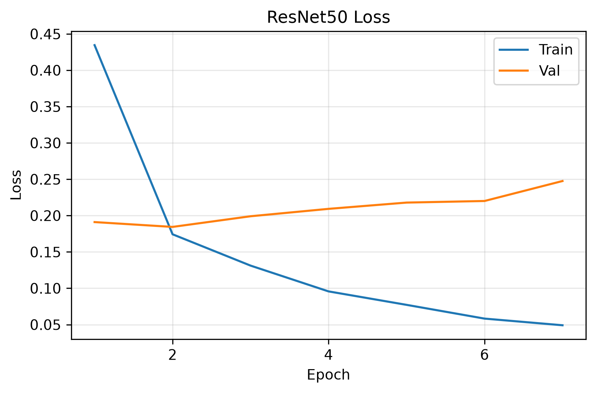
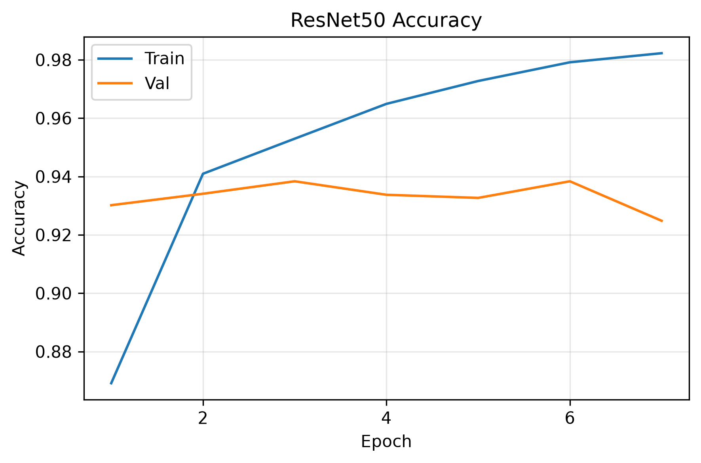
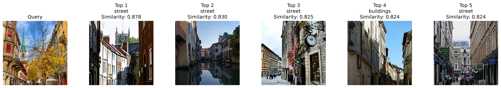
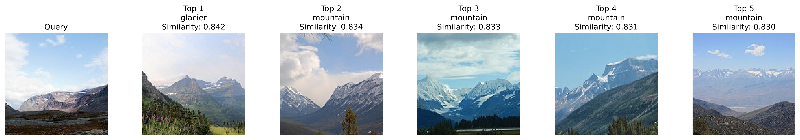
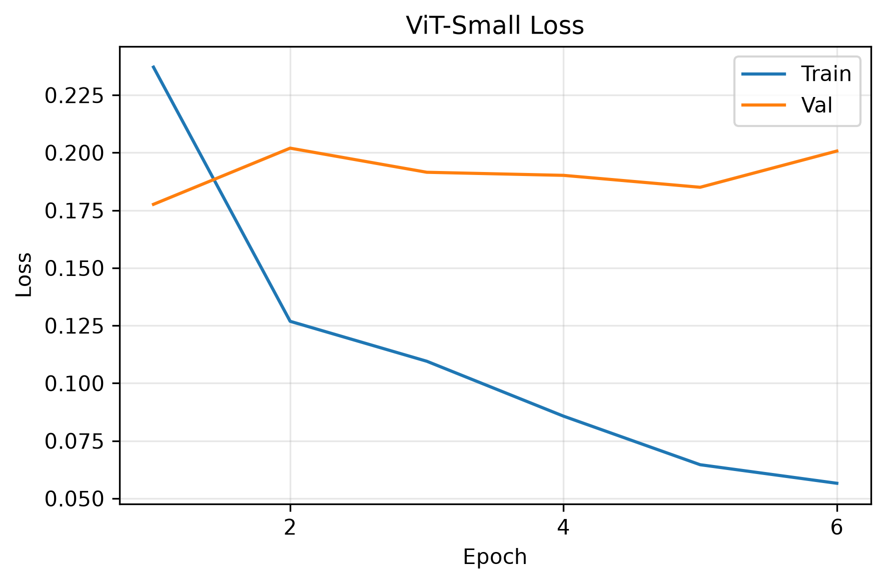
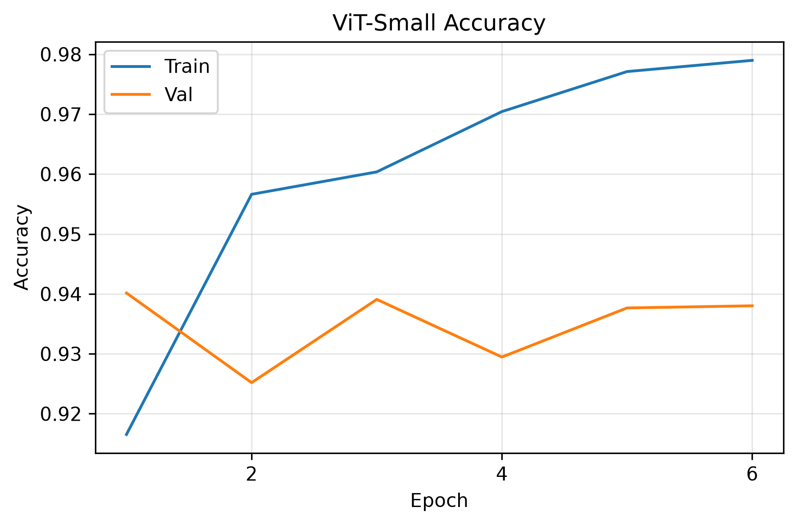
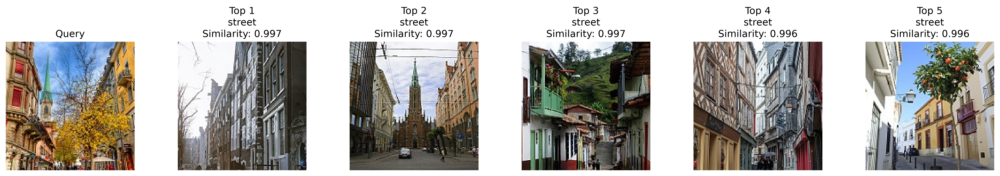
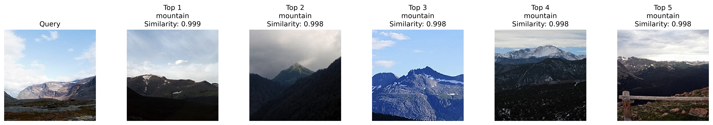

# quiz 1 基礎
## 載入預訓練ResNet-50，將分類層改成六類並微調模型
資料集使用`Intel Image Classification`，包含六種場景類別，掃描圖片路徑、標籤、尺寸、色彩模式，並檢查圖片是否能正常讀取。 
將`seg_train`資料案比例切成80% train、20% validation，`seg_test`做為模型完成的測試資料，`seg_pred`作為檢索推論的query。 
訓練圖片前處理使用`build_resnet_transforms()>`做隨機裁切、翻轉與顏色變化。 

利用`build_resnet50()`載入預訓練模型，將分類層改成六類並微調模型。 
模型使用`Cross-Entropy Loss`、`Adam`、`batch size=64`、`learning rate=0.0001`、`weight decay=0.0001`、`early stopping`，記錄最低val loss最後最佳模型。 

使用`build_feature_model()`複製最佳模型並移除分類層，使模型直接輸出影像特徵向量。 
以訓練圖片作為`gallery`，使用`extract_features()`固定前處理萃取並正規化特徵。 
從`seg pred`選取`query`，利用`show_retrieval()`計算與`gallery`的`cosine similarity`，找出`Top-5`相似圖片，並展示結果。

### 結果圖

# quiz 1 進階
## 載入預訓練ViT-Small，將分類層改成六類並微調模型
沿用`quiz 1 基礎`整體流程，使用`build_vit_transforms()`做資料前處理；利用`build_vit_small()`載入預訓練模型。 

### 結果圖

## 結果討論
在`test loss`部分，`resnet50`表現較好，而`test accuracy`部分則是`vit-small`表現較好，數值差異皆不大。 
影像檢索部分，`vit-small`給出的`similarities`分數較高，兩者找回的場景雖然都不同，但都符合`query`的圖片，個人認為`resnet50`找回的場景較精準。 
訓練過程中兩個模型皆出現過擬合現象，因此加入資料增強與`early stopping`，並使用最低`val loss`的模型權重進行測試與檢索。

# quiz 2 基礎